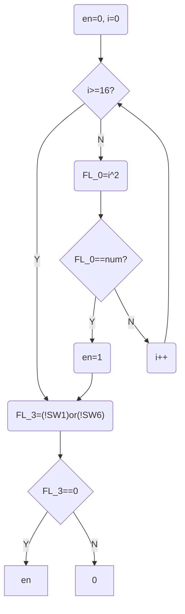

## 玩汞活动记录 2023 Ver. 

恩，总之还是浑浑噩噩地熬到现在了。[去年 wp 的 epilogue][hg2022-wp-epilogue]

一觉睡醒已经是 28 号下午，就没啥一血能抢了哈哈。

以下内容大致上是咱的玩汞活动记录


---

## 玩円神玩的（签到） 

这种一般都是改改 URL 的小把戏。

<!--但好像直接改 similarity 就提交会被打回来，就急了，对着 js 一顿改也改不出所以。-->


（似乎要先录制一遍提交上去？）结尾加参数 `?similarity=99.99999` 就行

这...太原了，不愧是 www.玩原神玩的.com


---

## 猫咪问答

~~感觉今年的全部难度都集中到第一问了~~

1. 做完后三道开始枚举（~~感觉还挺文明的，每次提交以后会保留已经填好的答案~~），非负整数就从 1 开始，做到 4 发现不太对劲，搜一下居然还有官网的

   
   
   点进去一看，原来有十几层啊，没事了（
   
   
   
   **12**，全部答对，分数到手（

2. 搜索 "chicken density in observable universe upper limit" 居然自动补全论文名字，太棒了。

   

   打开 [论文](https://arxiv.org/pdf/2303.17626.pdf) ，就能在倒数第二页看到结论，填一个 **23** 进去，得分（

   

3. 搜索 "compile TCP BBR" 出现了这个：https://github.com/google/bbr/blob/master/Documentation/bbr-quick-start.md 最后提到一个 **`CONFIG_TCP_CONG_BBR`** 填进去就蒙对了。

4. 搜索 "python mypy dead loop" 出现一篇论文：[*Python Type Hints Are Turing Complete*](https://drops.dagstuhl.de/opus/volltexte/2023/18237/pdf/LIPIcs-ECOOP-2023-44.pdf)，点进去看到 supplement material 提到 **ECOOP**，填入，得分。


## Deep♂er & dark♂er

[是不是每年都有银梦梗啊](https://blog.h3a.moe/src/EX00007/#%E9%BB%91%E8%89%B2%E9%AB%98%E7%BA%A7%E8%87%AA%E5%8A%A8%E6%9C%BA%EF%BC%88Flag-%E8%87%AA%E5%8A%A8%E6%9C%BA%EF%BC%89)，端口号怎么是 11451（


但是呢就算一直按着 pgdown 也不是个头，就想去看看有没有哪里骗 flag 的，结果给在 main.js 里面碰上了：


那在 console 里面<!--亲自-->执行一遍就可以了：

```javascript
hash = CryptoJS.SHA256(`dEEper_@nd_d@rKer_${localStorage.token}`).toString();
flag = `flag{T1t@n_${hash.slice(0, 32)}}`
```


---

## 测不了速了（旅行照片）

**别的都可以做不出来，OSINT 我决不允许自己做不出来！**

题面的照片里隐约有去年题目里的 ZOZO stadium，我没有去求证，没想到官方 wp 自己提到了。

下了五张图，结果都把 exif 信息给删了，测不了速了（

实际做出的顺序大概是 (1,2) (5,6) (3,4)

中间这个活动真给我难住了


1. 第一个日期就给我难住了。是从第 6 题的海报中找到大致日期范围是 2023-08-03 到 2023-08-13，然后瞎蒙了一个 **10** 结果对了。后面注意到学长脖子上的 STATPHYS28，是在 08-07 到 08-11，更接近。**最后做到第五题才发现 10 号晚上才有聚餐，笑死。**

2. Google 识图发现奖牌是诺贝尔奖（我的天，牛啊），然后搜一下 "M. Koshiba MMII" 发现是在 2002 年得到物理学奖的小柴昌俊，1926 年生人。随后搜 "Tokyo university nobel prize exhibit" 发现 [东大的一个网页](https://www.s.u-tokyo.ac.jp/en/gallery/nobelprize/) ，点进去看到三个人，剩下两个是真鍋淑郎（1931）和梶田隆章（1959），梶田的网页 [URL](https://www.icrr.u-tokyo.ac.jp/prwps/commemorative/nobel/description.html) 一看就是 **ICRR** 的，他的 [Wikipedia](https://en.wikipedia.org/wiki/Takaaki_Kajita) 页面也证实了这一点。

3. 搜 ueno museum with a fountain in front of it 从各种照片判断是東京国立博物館。学长脖子上的 STATPHYS28 是在东大本乡校区。位置接近。**重新搜图发现是上野公园（ueno park）的活动。**经由标志性的七座喷泉，在卫星图上确认了一遍。

   

   

   数度搜索都不顺利，使用 `"上野公園" 2023/8/10` 搜索，找到了一个叫做“全国梅酒まつりin東京2023”的活动。点进去一看时间，完全一致。

   

   

   终于看到了 staff 募集的网页，代码 **S495584522**

   

   

4. 不理解，试了 1000 和 500 都不对，**结果 0 对了**。

   ~~还能带学弟玩证明没残 看着也不老 那只能是未成年了~~

   

5. 从 STATPHYS28 日程来看是 10 号晚上举行 [聚餐](https://statphys28.org/banquet.html) 。然后往下划看到了 meeting point，这不就是当年东大全共闘占领的**安田講堂**？想念三岛先生。

   

6. 搜索“JR 上野 ボタン＆カフリンクス”找到了那张海报，是（大）**熊猫**

   

   识图判断出站位置是 Shibuya

   ~~这照片拍得就像在游戏里的截图一样，我差点以为这人是回酒店玩 Minecraft 了~~

   

   然后 Google 的自动补全永远不会让你失望：**秋田犬**

   

   

---

## 我脑子有病（赛博井字棋）

看起来前端做不了什么，没有 flag，数据丢给后端处理。

查了下，井子棋先手有不输的下法。先下在任意角，然后对手不下中间就必赢。如果对手下中间就下在对角，至少不输。

下了一整天全是平手。就盘算可能要对 POST 表单下点手脚。**不敢想，真就是吃棋子。**

但是观察发现 AI 很机灵，都是下中间，那我可以试试最后吃掉中间的棋子。

按照棋盘坐标就是

```
[0][0] -> [2][2] -> [1][1]
```

每次的动作都是通过 POST 表单完成。需要用的应该只有清零 `'act': 'reset'` 和下子 `{'x':a, 'y':b} // a,b is in {0,1,2}` ，然后后端把它下出来的棋盘发过来。

用 py 丢三个 POST 上去应该就行。

今年换了鉴权方式，直接 `?token=` 已经不能用了，只能开个网页然后借 Cookie 来用，但是被奇葩的 `Set-Cookie` 折腾了一下午，不处理就一直是重开一局，保不住棋局的状态。`requests.Session` 居然在自己设置 Cookie 以后就不处理 `Set-Cookie` 了，我还要自己处理 response header 发来的新 Cookie. <!--此处友好问候 python-requests 开发者和本题出题人。-->

```python
import requests
import logging
import http.client as http_client
import re

http_client.HTTPConnection.debuglevel = 1

# You must initialize logging, otherwise you'll not see debug output.
logging.basicConfig()
logging.getLogger().setLevel(logging.DEBUG)
requests_log = logging.getLogger("requests")
requests_log.setLevel(logging.DEBUG)
requests_log.propagate = True


def getNextCookie(header):
    SetCookie = header['Set-Cookie']
    regexp = re.compile("session\=(.*)\;\ HttpOnly\; Path\=\/")
    nextCookie = re.findall(regexp, SetCookie)[0]
    return nextCookie


with requests.Session() as hgsession:
    hgheaders = {
        'Cookie': 'session=<YOUR_SESSION>'
    }

    r = hgsession.get(
        'http://202.38.93.111:10077/', 
        headers = hgheaders,
        )
    
    print(r.headers)
    # [0,0] -> [2,2] -> [1,1] 
    # so that the AI cannot win

    r = hgsession.post(
        'http://202.38.93.111:10077/',
        headers = hgheaders, 
        json = { 'act': 'reset' }
        # data = { 'x':0, 'y':0 }
        )
    nextCookie = getNextCookie(r.headers)
    # print(nextCookie)
    
    r = hgsession.post(
        'http://202.38.93.111:10077/',
        headers = {'Cookie': 'session=' + nextCookie}, 
        json = { 'x':0, 'y':0 }
        # data = { 'x':0, 'y':0 }
        )
    print(r.text)
    nextCookie = getNextCookie(r.headers)

    r = hgsession.post(
        'http://202.38.93.111:10077/',
        headers = {'Cookie': 'session=' + nextCookie}, 
        json = { 'x':2, 'y':2 }
        # data = { 'x':0, 'y':0 }
        )
    print(r.text)
    nextCookie = getNextCookie(r.headers)

    r = hgsession.post(
        'http://202.38.93.111:10077/',
        headers = {'Cookie': 'session=' + nextCookie}, 
        json = { 'x':1, 'y':1 }
        # data = { 'x':0, 'y':0 }
        )
    print(r.text)
    # nextCookie = getNextCookie(r.headers)

```

后来听说了中间人抓包非常简单，但我不太想弄,是我太笨了。

做了一下午，我脑子有病。


---

## 发梦时记得关机（奶奶的睡前 flag 故事）

[一堆人交过了](https://www.aperisolve.com/878ded37c75d5fd949c5d4dfc0a6735f)，看了下是文件结尾的问题：在 IEND 之后还有一大堆数据。

对着二进制和 PNG 结构折腾了很久，也没能看出来什么，直到重看题面，突然意识到之前大家都在转发的 Google Pixel 截图工具出过一个 [CVE-2023-21036](https://cve.report/CVE-2023-21036)，我当时已经升上去很久了，就没管这个事情，这次想起来再去搜搜看。

CVE 原作者分享过[心路历程](https://www.da.vidbuchanan.co.uk/blog/exploiting-acropalypse.html)（

好家伙，在线 demo 都有了：


不由得想到之前那个用 SIM 卡 PUK 绕过锁屏的 [CVE-2022-20465](https://cve.mitre.org/cgi-bin/cvename.cgi?name=CVE-2022-20465)，再次建议各位及时更新。

同时，请时刻牢记，屏幕截图可能含有重要的隐私信息，务必小心谨慎处理。

另外，引用某位 IT 界 HKer 在那年的大雨中发出的忠告：发梦时记得关机。


---

## 组委会模拟器

看了下要处理的元素长这样：


**大概感觉是用个 userscript 去帮我 click**，但我不会 js 啊，那就<!--亲自-->指挥 chatgpt 帮我写（

prompt 如下：

> I need to write a js userscript to capture some content and perform a click for the specific element. How should I start it
> 
> the element I need to find looks like this: "<div  class="fakeqq-message__bubble"><div  class="fakeqq-message__bubble-arrow"></div><span>这道题 flag 是hack[vbzpobcbwyioysfz]</span></div>"
> 
> The condition to click is that the <span> element contains a  substring that starts with "hack", then a pair of square brackets with some chars in it.
> 
> well, the page scrolls very quickly. so I need to quickly find the newly added elements, how to do that?


多次迭代后，最终得到了如下能用的回复：


> To quickly find and interact with newly added elements on a page that scrolls quickly, you can use Mutation Observers. A Mutation Observer is a JavaScript API that allows you to watch for changes in the DOM (Document Object Model) and react to those changes in real-time. Here's how you can use a Mutation Observer to find and interact with newly added elements:
>
> ```javascript
> (function() {
>     // Function to check if a message is a "hack" message
>     function isHackMessage(messageText) {
>         return messageText && messageText.startsWith("这道题 flag 是hack[") && messageText.endsWith("]");
>     }
> 
>     // Function to process a single message
>     function processMessage(messageBubble) {
>         const messageText = messageBubble.querySelector('span');
>         if (isHackMessage(messageText.textContent.trim())) {
>             console.log('Captured content:', messageText.textContent.trim());
>             messageBubble.click();
>         }
>     }
>     
>     // Callback function for the Mutation Observer
>     function handleMutations(mutationsList, observer) {
>         for (const mutation of mutationsList) {
>             if (mutation.type === 'childList') {
>                 // New elements have been added
>                 for (const node of mutation.addedNodes) {
>                     if (node.nodeType === Node.ELEMENT_NODE) {
>                         const messageBubble = node.querySelector('.fakeqq-message__bubble');
>                         if (messageBubble) {
>                             processMessage(messageBubble);
>                         }
>                     }
>                 }
>             }
>         }
>     }
>     
>     // Set up a Mutation Observer to watch for changes in the DOM
>     const targetNode = document.body; // You can change the target node to be more specific
>     const config = { childList: true, subtree: true };
>     const observer = new MutationObserver(handleMutations);
>     observer.observe(targetNode, config);
> })();
> 
> ```
>
> In this code:
>
> - The `handleMutations` function is the callback for the Mutation Observer. It checks for added nodes and, if they are elements, it looks for the message bubble and processes it if it's a "hack" message.
> - The Mutation Observer watches for changes in the DOM, specifically child node additions (`childList: true`) and sub-tree mutations (`subtree: true`). You can adjust the `targetNode` to target a more specific part of the DOM if necessary.
>
> This code will monitor the DOM for any newly added elements with the class "fakeqq-message__bubble" and process them as they are added, making it suitable for pages with rapidly scrolling content.

唉，头一次弄出一个能用的用户脚本，看它自动撤回真的好爽啊（


---

## 考 A 证，有 A 罩（虫）

是一个音频文件，听一耳朵就知道是 SSTV. 那就很简单了，随便丢给一个 SSTV 解码器放一遍就出来了。

*P.S. 感觉这张图有改造成梗图的潜力（（*


---

## YAML 工程师（JSON ⊂ YAML?）

读 YAML1.1 标准文档中的 JSON Schema，注意到有个地方解析出来的不太一样。


直接借来用，出 flag1

```json
{"key1": Infinity}
```

接着读


再来一遍，得 flag2

```json
{"key1": Infinity, "key1": 1}
```


---


## 真是个饭桶呢 ww~（Git？Git！）

诶呀，这个我熟。~~咱之前可是动不动就 reset 一下，不要太熟练了~~

<!-- 因为换 gpg key 把所有的 commit 都重签过，比起那个这都是小意思。 -->

你的确 reset 了，可是 commit 并没有消失，只是脱离了 commit graph 而已。

只要 `git reflog` 一下就能看到之前 reset 掉的 commit，很明显是从 `505e1a3` reset 到了 `15fd0a1`


对比一下 `git log` 看到的


那大概就是这个样子（mermaid 里面的 gitGraph 只能画成这样了，**实际上 `505e1a3` 是没有 main- 指针的**，请见谅）


那就很简单了，直接 `git checkout 505e1a3` 就行，然后看一下 log 的修改就知道去哪找 flag 了（这个 git user 配得太申必了


哈哈，吃了饭桶里的后悔药，也是会被发现的（（


---

## HTTP 集邮册

真得对着 MDN 文档一个个折腾，绷不住了

100 

```
GET / HTTP/1.1\r\n
Host: example.com\r\n
Expect: 100-continue\r\n
\r\n
```

304

```
GET / HTTP/1.1\r\n
Host: example.com\r\n
If-None-Match: *\r\n
\r\n
```

414

这个害得我的 Firefox 崩溃三次

```
GET /very/long/resource/path/that/exceeds/the/allowed/very/long/resource/path/that/exceeds/the/allowed/very/long/resource/path/that/exceeds/the/allowed/very/long/resource/path/that/exceeds/the/allowed/very/long/resource/path/that/exceeds/the/allowed/very/long/resource/path/that/exceeds/the/allowed/very/long/resource/path/that/exceeds/the/allowed/very/long/resource/path/that/exceeds/the/allowed/very/long/resource/path/that/exceeds/the/allowed/very/long/resource/path/that/exceeds/the/allowed/very/long/resource/path/that/exceeds/the/allowed/very/long/resource/path/that/exceeds/the/allowed/very/long/resource/path/that/exceeds/the/allowed/very/long/resource/path/that/exceeds/the/allowed/very/long/resource/path/that/exceeds/the/allowed/very/long/resource/path/that/exceeds/the/allowed/very/long/resource/path/that/exceeds/the/allowed/very/long/resource/path/that/exceeds/the/allowed/very/long/resource/path/that/exceeds/the/allowed/very/long/resource/path/that/exceeds/the/allowed/very/long/resource/path/that/exceeds/the/allowed/very/long/resource/path/that/exceeds/the/allowed/very/very/long/resource/path/that/exceeds/the/allowed/very/long/resource/path/that/exceeds/the/allowed/very/long/resource/path/that/exceeds/the/allowed/very/long/resource/path/that/exceeds/the/allowed/very/long/resource/path/that/exceeds/the/allowed/very/long/resource/path/that/exceeds/the/allowed/very/long/resource/path/that/exceeds/the/allowed/very/long/resource/path/that/exceeds/the/allowed/very/long/resource/path/that/exceeds/the/allowed/very/long/resource/path/that/exceeds/the/allowed/very/long/resource/path/that/exceeds/the/allowed/very/long/resource/path/that/exceeds/the/allowed/very/long/resource/path/that/exceeds/the/allowed/very/long/resource/path/that/exceeds/the/allowed/very/long/resource/path/that/exceeds/the/allowed/very/long/resource/path/that/exceeds/the/allowed/very/long/resource/path/that/exceeds/the/allowed/very/long/resource/path/that/exceeds/the/allowed/very/long/resource/path/that/exceeds/the/allowed/very/long/resource/path/that/exceeds/the/allowed/very/long/resource/path/that/exceeds/the/allowed/very/long/resource/path/that/exceeds/the/allowed/very/long/resource/path/that/exceeds/the/allowed/very/long/resource/path/that/exceeds/the/allowed/very/long/resource/path/that/exceeds/the/allowed/very/long/resource/path/that/exceeds/the/allowed/very/long/resource/path/that/exceeds/the/allowed/very/long/resource/path/that/exceeds/the/allowed/very/long/resource/path/that/exceeds/the/allowed/very/long/resource/path/that/exceeds/the/allowed/very/long/resource/path/that/exceeds/the/allowed/very/long/resource/path/that/exceeds/the/allowed/very/long/resource/path/that/exceeds/the/allowed/very/long/resource/path/that/exceeds/the/allowed/very/long/resource/path/that/exceeds/the/allowed/very/long/resource/path/that/exceeds/the/allowed/very/long/resource/path/that/exceeds/the/allowed/very/long/resource/path/that/exceeds/the/allowed/very/long/resource/path/that/exceeds/the/allowed/very/long/resource/path/that/exceeds/the/allowed/very/long/resource/path/that/exceeds/the/allowed/very/long/resource/path/that/exceeds/the/allowed/very/long/resource/path/that/exceeds/the/allowed/very/long/resource/path/that/exceeds/the/allowed/very/long/resource/path/that/exceeds/the/allowed/very/long/resource/path/that/exceeds/the/allowed/very/long/resource/path/that/exceeds/the/allowed/very/long/resource/path/that/exceeds/the/allowed/very/long/resource/path/that/exceeds/the/allowed/very/long/resource/path/that/exceeds/the/allowed/very/long/resource/path/that/exceeds/the/allowed/very/long/resource/path/that/exceeds/the/allowed/very/long/resource/path/that/exceeds/the/allowed/very/long/resource/path/that/exceeds/the/allowed/very/long/resource/path/that/exceeds/the/allowed/very/long/resource/path/that/exceeds/the/allowed/very/long/resource/path/that/exceeds/the/allowed/very/long/resource/path/that/exceeds/the/allowed/very/long/resource/path/that/exceeds/the/allowed/very/long/resource/path/that/exceeds/the/allowed/very/long/resource/path/that/exceeds/the/allowed/very/long/resource/path/that/exceeds/the/allowed/very/long/resource/path/that/exceeds/the/allowed/very/long/resource/path/that/exceeds/the/allowed/very/long/resource/path/that/exceeds/the/allowed/very/long/resource/path/that/exceeds/the/allowed/very/long/resource/path/that/exceeds/the/allowed/very/long/resource/path/that/exceeds/the/allowed/very/long/resource/path/that/exceeds/the/allowed/very/long/resource/path/that/exceeds/the/allowed/very/long/resource/path/that/exceeds/the/allowed/very/long/resource/path/that/exceeds/the/allowed/very/long/resource/path/that/exceeds/the/allowed/very/long/resource/path/that/exceeds/the/allowed/very/long/resource/path/that/exceeds/the/allowed/very/long/resource/path/that/exceeds/the/allowed/very/long/resource/path/that/exceeds/the/allowed/very/long/resource/path/that/exceeds/the/allowed/very/long/resource/path/that/exceeds/the/allowed/very/long/resource/path/that/exceeds/the/allowed/very/long/resource/path/that/exceeds/the/allowed/very/long/resource/path/that/exceeds/the/allowed/very/long/resource/path/that/exceeds/the/allowed/very/long/resource/path/that/exceeds/the/allowed/very/long/resource/path/that/exceeds/the/allowed/very/long/resource/path/that/exceeds/the/allowed/very/long/resource/path/that/exceeds/the/allowed/very/long/resource/path/that/exceeds/the/allowed/very/long/resource/path/that/exceeds/the/allowed/very/long/resource/path/that/exceeds/the/allowed/very/long/resource/path/that/exceeds/the/allowed/very/long/resource/path/that/exceeds/the/allowed/very/long/resource/path/that/exceeds/the/allowed/very/long/resource/path/that/exceeds/the/allowed/very/long/resource/path/that/exceeds/the/allowed/very/long/resource/path/that/exceeds/the/allowed/very/long/resource/path/that/exceeds/the/allowed/very/long/resource/path/that/exceeds/the/allowed/very/long/resource/path/that/exceeds/the/allowed/very/long/resource/path/that/exceeds/the/allowed/very/long/resource/path/that/exceeds/the/allowed/very/long/resource/path/that/exceeds/the/allowed/very/long/resource/path/that/exceeds/the/allowed/very/long/resource/path/that/exceeds/the/allowed/very/long/resource/path/that/exceeds/the/allowed/very/long/resource/path/that/exceeds/the/allowed/very/long/resource/path/that/exceeds/the/allowed/very/long/resource/path/that/exceeds/the/allowed/very/long/resource/path/that/exceeds/the/allowed/very/long/resource/path/that/exceeds/the/allowed/very/long/resource/path/that/exceeds/the/allowed/very/long/resource/path/that/exceeds/the/allowed/very/long/resource/path/that/exceeds/the/allowed/very/long/resource/path/that/exceeds/the/allowed/very/long/resource/path/that/exceeds/the/allowed/very/long/resource/path/that/exceeds/the/allowed/very/long/resource/path/that/exceeds/the/allowed/very/long/resource/path/that/exceeds/the/allowed/very/long/resource/path/that/exceeds/the/allowed/very/long/resource/path/that/exceeds/the/allowed/very/long/resource/path/that/exceeds/the/allowed/very/long/resource/path/that/exceeds/the/allowed/very/long/resource/path/that/exceeds/the/allowed/very/long/resource/path/that/exceeds/the/allowed/very/long/resource/path/that/exceeds/the/allowed/very/long/resource/path/that/exceeds/the/allowed/very/long/resource/path/that/exceeds/the/allowed/very/long/resource/path/that/exceeds/the/allowed/very/long/resource/path/that/exceeds/the/allowed/very/long/resource/path/that/exceeds/the/allowed/very/long/resource/path/that/exceeds/the/allowed/very/long/resource/path/that/exceeds/the/allowed/very/long/resource/path/that/exceeds/the/allowed/very/long/resource/path/that/exceeds/the/allowed/very/long/resource/path/that/exceeds/the/allowed/very/long/resource/path/that/exceeds/the/allowed/very/long/resource/path/that/exceeds/the/allowed/very/long/resource/path/that/exceeds/the/allowed/very/long/resource/path/that/exceeds/the/allowed/very/long/resource/path/that/exceeds/the/allowed/very/long/resource/path/that/exceeds/the/allowed/very/long/resource/path/that/exceeds/the/allowed/very/long/resource/path/that/exceeds/the/allowed/very/long/resource/path/that/exceeds/the/allowed/very/long/resource/path/that/exceeds/the/allowed/very/long/resource/path/that/exceeds/the/allowed/very/long/resource/path/that/exceeds/the/allowed/very/long/resource/path/that/exceeds/the/allowed/very/long/resource/path/that/exceeds/the/allowed/very/long/resource/path/that/exceeds/the/allowed/very/long/resource/path/that/exceeds/the/allowed/very/long/resource/path/that/exceeds/the/allowed/very/long/resource/path/that/exceeds/the/allowed/very/long/resource/path/that/exceeds/the/allowed/very/long/resource/path/that/exceeds/the/allowed/very/long/resource/path/that/exceeds/the/allowed/very/long/resource/path/that/exceeds/the/allowed/very/long/resource/path/that/exceeds/the/allowed/very/long/resource/path/that/exceeds/the/allowed/very/long/resource/path/that/exceeds/the/allowed/very/long/resource/path/that/exceeds/the/allowed/very/long/resource/path/that/exceeds/the/allowed/very/long/resource/path/that/exceeds/the/allowed/very/long/resource/path/that/exceeds/the/allowed/very/long/resource/path/that/exceeds/the/allowed/very/long/resource/path/that/exceeds/the/allowed/very/long/resource/path/that/exceeds/the/allowed/very/long/resource/path/that/exceeds/the/allowed/very/long/resource/path/that/exceeds/the/allowed/very/long/resource/path/that/exceeds/the/allowed/very/long/resource/path/that/exceeds/the/allowed/very/long/resource/path/that/exceeds/the/allowed/very/long/resource/path/that/exceeds/the/allowed/very/long/resource/path/that/exceeds/the/allowed/very/long/resource/path/that/exceeds/the/allowed/very/long/resource/path/that/exceeds/the/allowed/very/long/resource/path/that/exceeds/the/allowed/very/long/resource/path/that/exceeds/the/allowed/very/long/resource/path/that/exceeds/the/allowed/very/long/resource/path/that/exceeds/the/allowed/long/resource/path/that/exceeds/the/allowed/very/long/resource/path/that/exceeds/the/allowed/very/long/resource/path/that/exceeds/the/allowed/very/long/resource/path/that/exceeds/the/allowed/very/long/resource/path/that/exceeds/the/allowed/very/long/resource/path/that/exceeds/the/allowed/limit/and/so/on/for/a/very/long/time?query=parameter&name=value&with=some&very=long&query=parameters&that=exceeds=the=allowed=limit&and=so=on&for=a=very=long=time  HTTP/1.1\r\n
Host: localhost\r\n
\r\n
```

413 

```
POST /upload HTTP/1.1\r\n
Host: localhost\r\n
Content-Length: 10000000\r\n\r\n
```

206

```
GET / HTTP/1.1\r\n
Host: example.com\r\n
Range: bytes=100-200\r\n
\r\n
```

200

```
GET / HTTP/1.1\r\n
Host: example.com\r\n\r\n
```

505

```
GET / HTTP/2\r\n
Host: localhost\r\n
```

404

```
GET /qqq HTTP/1.1\r\n
Host: example.com\r\n
\r\n
```

416

```
GET / HTTP/1.1\r\n
Host: example.com\r\n
Range: bytes=1000-500\r\n
\r\n
```

412

```
GET / HTTP/1.1\r\n
Host: example.com\r\n
If-Unmodified-Since: Wed, 21 Oct 2015 07:28:00 GMT\r\n
\r\n
```

405

POST / PUT 都是这个行为

```
PUT / HTTP/1.1\r\n
Host: example.com\r\n
```

400

```
GET HTTP/1.1\r\n
Host: example.com\r\n
\r\n
```

no status??从代码看是少写最后的 `\r\n`

我也记不得了，但那个代码大概是这样的

```
GET / \r\n

```


---

## Docker for Everyone

随便找了找 flag 在哪里，看了下权限，只有 root 能读。

你这里上不去权限，但是 docker 能上权限啊，能开出 alpine 容器，那里面是 root 啊，不就等于一个 sudo 了（（

然后把本地的文件夹 mount 进去，不就随便读了，笑死（


---

## 模仿游戏 图灵再世（惜字如金 2.0）

本来差点放弃了，但是仔细看了一遍代码以后发现 `flag{` 和 `}` 是固定的。

我不由得想起 *The Imitation Game* 当中，破译 Enigma 的灵光一闪：德国人每天早上的广播的结尾是一样的。

代码里面有这样一行：

```python
check_equals(set(len(s) for s in cod_dict), {24})
```

决定了每行必加一个字母。

对于每一行，这样加完以后，首尾的 offset 应该与如下值完全一致：

```
00    23
24    47
48    71
72    95
96    119
```

我们就先不加上那一个字母，但是按照新的 offset 去算。

就近选字母，以每行开头参照，算出新的 offset. 

```
f 52     L3
l 41     L2
a 84/85  L4
g 108    L5
{ 74     L4
} 28     L2
```

而在输出 flag 代码里的预期值是：

```
f 53
l 41
a 85
g 109
{ 75
} 28
```

就知道如果少于预期值就在这个字符前面补，否则在后面补

实际操作的时候赌了一把，全部在最前面和最后面加。

第一行没有涉及上面的字符，大胆地加在了最后。

完整代码

```diff
#!/usr/bin/python3

# Th siz of th fil may reduc after XZRJification

def check_equals(left, right):
    # check whether left == right or not
    if left != right: exit(1)

def get_cod_dict():
    # prepar th cod dict
    cod_dict = []
-    cod_dict += ['nymeh1niwemflcir}echaet']
+    cod_dict += ['nymeh1niwemflcir}echaetA']
-    cod_dict += ['a3g7}kidgojernoetlsup?h']
+    cod_dict += ['a3g7}kidgojernoetlsup?hB']
-     cod_dict += ['ulw!f5soadrhwnrsnstnoeq']
+    cod_dict += ['Culw!f5soadrhwnrsnstnoeq']
-     cod_dict += ['ct{l-findiehaai{oveatas']
+    cod_dict += ['Dct{l-findiehaai{oveatas']
-     cod_dict += ['ty9kxborszstguyd?!blm-p']
+    cod_dict += ['Ety9kxborszstguyd?!blm-p']
    check_equals(set(len(s) for s in cod_dict), {24})
    return ''.join(cod_dict)

def decrypt_data(input_codes):
    # retriev th decrypted data
    cod_dict = get_cod_dict()
    output_chars = [cod_dict[c] for c in input_codes]
    return ''.join(output_chars)

if __name__ == '__main__':
    # check som obvious things
    # check_equals('creat', 'cr' + 'at')
    # check_equals('referer', 'refer' + 'rer')
    # check th flag
    flag = decrypt_data([53, 41, 85, 109, 75, 1, 33, 48, 77, 90,
                         17, 118, 36, 25, 13, 89, 90, 3, 63, 25,
                         31, 77, 27, 60, 3, 118, 24, 62, 54, 61,
                         25, 63, 77, 36, 5, 32, 60, 67, 113, 28])
    check_equals(flag.index('flag{'), 0)
    check_equals(flag.index('}'), len(flag) - 1)
    # print th flag
    print(flag)

```

最后发现有一个字母变成了大写的 C，那就是第三行开头的。

flag 看起来是一个英文句子，大胆猜测是本来应该是小写 u，还原惜字如金应该补在后面（`uClw!`）

蒙对。


---

## 终端字符画电影院（高频率星球）

```bash
asciinema cat asciinema_restore.rec > output.js
```

掐头去尾，留下中间的 js

接着在 VSCode 里面把报错的地方删掉就行

一开始是我想复杂了（见注释）

<!--然后按顺序操作。未写出具体替换的则是删除-->

<!--regexp: \[\d+\.\d+, "o", "-->
<!--\u001b[K"]-->
<!-- \r\n: -->
<!--\u001b[K~\b~\r-->
<!--\r\u001b[K \u001b[KESC\b\b\bESC\u001b[K[\b[\u001b[K6\b6-->

<!--\",\r\n  变成 ",真的换行-->
<!--,\r\n  ,变成真的换行-->

<!--\" -> " -->

<!--\u001b[K~\b~\r\u001b[K--> 

<!--"]带换行 删掉-->

<!--\r\u001b[K \u001b[KESC\b\b\bESC\u001b[K[\b[\u001b[K6\b6 真的换行-->

<!--精修 h"] 和 \r-->


---

## 为什么！（流式星球）

读了小半天代码大概看出来是把每一帧都读出来，然后顺序输出成二进制。

我自己的理解是这样的

```
buffer[frame][height][width][color_channel]

buffer[frame*height*width][color_channel]

buffer[frame*height*width*color_channel]
```

那要做的就是进行一个反变换，但是反过来就是因数分解，肯定更难。而且生成流的代码会在最后随机删除 0-100 个字节，使得通过字节数猜测分辨率和帧数几乎不可能，只能猜。内容只有视频流所以不考虑其他，无脑相乘就行。

```python
import cv2
import numpy as np

def convert_binary_to_mp4(input_file, output_file, frame_width, frame_height, frame_count):
    # Read the binary data from the file
    buffer = np.fromfile(input_file, dtype=np.uint8)
    
    # Reshape the data to the original shape
    buffer = buffer.reshape((frame_count, frame_height, frame_width, 3))
    
    # Create a VideoWriter object to save the frames as an MP4 video
    fourcc = cv2.VideoWriter_fourcc(*'mp4v')  # Codec for MP4 format
    out = cv2.VideoWriter(output_file, fourcc, 30, (frame_width, frame_height))
    
    # Write each frame to the video file
    for frame in buffer:
        out.write(frame)
    
    # Release the VideoWriter
    out.release()

if __name__ == "__main__":
    input_file = "xaa"
    output_file = "output_video.mp4"
    frame_width =  427    # Enter the frame width used in your original code
    frame_height = 759  # Enter the frame height used in your original code
    frame_count =  138   # Enter the frame count used in your original code

    convert_binary_to_mp4(input_file, output_file, frame_width, frame_height, frame_count)

```

一开始不太确信这个代码能用，还自己用了 kazam 录了一个很小的屏，再用题目给的代码转成流，再转换回来。虽然画质稍有下降，但应该恢复了了八成。

当然了，这里的帧数和宽高是要自己指定的。

这个代码有个不好就是：每次都要提前算好帧数和对应的比特流大小，然后用 `split` 把题目给的 bin 切成这个大小（所以你才会看到 xaa 这个文件名。就这都比我一开始傻不拉叽用 `dd bs=1` 好多了）

拿几个常见的分辨率了一下，只有 640*480 的勉强能看，然后大概知道 flag 在视频后半段。

这个画面实在是太模拟电视了，梦回世纪之交

*P.S. 我非常在意为什么会出现这样的图像，以前是真的因为分辨率不足，那这又是**为什么**？*

*P.P.S. 好了，看完神司的 wp 以后就懂了。同一行上两个重复内容的距离就是本来的宽度。*


列表，计算所需的 bit stream 大小

csv 格式：

width, height, sizeof(frame), sizeof(video.bin)/sizeof(frame), floor(frames), sizeof(frame)*floor(frames)


**分辨率大了重影更多，那宽度应该更小，但是如果太小了也是对不准，那估计和 640*480 差不到哪里去。**

那就再试试，结果无一例外还是不行


后面看了生成代码分辨率不能以 0 结尾，

```python
    assert frame_width % 10 != 0
    assert frame_height % 10 != 0
```

意识到不应该瞎猜常见分辨率，每次抠掉 bin 的结尾来 make numpy happy，再还原一整个视频；而应该先对每个可能的分辨率采一点样，然后一个个识别，于是开始糊采样代码。


不会接入 OCR 真的痛苦，得自己一张张去看。然后硬是找到这张能看的，但是重影里还能看到字幕，那看来高度不够


跑完宽度跑高度，不过高度还好，就算稍有偏差，画面的偏移也不大

```diff
import cv2
import numpy as np

if __name__ == "__main__":
    input_file = "video.bin"  # Assuming you have the binary data already loaded

    # Load the binary data into the buffer (you should have the buffer already)
    buffer = np.fromfile(input_file, dtype=np.uint8)

    # Define the range for frame_width and frame_height
-    for frame_width in range(100, 640, 1):
+    for frame_width in range(427, 428, 1):
-        for frame_height in range(432, 433, 1):
+        for frame_height in range(600, 800, 1):
            # Calculate the size of one frame
            frame_size = frame_width * frame_height * 3  # 3 color channels (assuming no compression)
            # Extract the data of the 1st frame
            first_frame_data = buffer[:frame_size].reshape((frame_height, frame_width, 3))
            # Save the 1st frame as an image
            filename = f"{frame_width}_{frame_height}.png"  # Output image file
            cv2.imwrite(filename, first_frame_data)

```

逐张辨识，直到字幕位置合适


然后计算帧数和大小


成功了（


~~这不就手机短视频分辨率，是我落伍了~~

~~最后更是意识到应该去找那个B站帐号 MyGO_Official（（（~~

还有我怎么看到题解各位做出来 bangdream 的字都是黄色的，就我调出来是蓝色吗，问了群友说是 OpenCV 颜色通道顺序反了，弄成 BGR 了，但我真的没感觉到啊...

也就只有做做 misc 的份了，后面的计算器那题根本做不出来。唉，羡慕 MyGO，这部番我都还没看


---

## 低带宽星球

随便找个在线工具压缩一下，搞定 2KB

第二问就知道是三个大色块，但是不知道怎么压，摆烂


---

## Batter my heart, three-personed God (Komm, süsser Flagge)

<!--本来就对本题捏他的那位很能共情，做这题的时候感觉更能理解她了。-->

**从没觉得 TCP 有意思过**

```
-A myTCP-1 -p tcp -m string --algo bm --string "POST" -j REJECT --reject-with tcp-reset
```

过滤字符串 POST 的

想了下 payload 应该可以切开的，那要么试试？

```python
import socket
import time

target_ip = "202.38.93.111"
target_port = 18082
token = "YOUR_TOKEN"

# establish TCP conn
s = socket.socket(socket.AF_INET, socket.SOCK_STREAM)
s.connect((target_ip, target_port))

# "PO"
s.send(b"PO")
time.sleep(0.1)  

# "ST / HTTP/1.1"
request = "ST / HTTP/1.1\r\nHost: {}\r\nContent-Length: {}\r\n\r\n{}".format(target_ip, len(token), token)
s.send(request.encode())
# get response
response = s.recv(4096)
print(response.decode())

# close conn
s.close()

```

===

**那样就和单纯的复制没什么区别了**

```
-A myTCP-2 -p tcp -m u32 --u32 "0 >> 22 & 0x3C @ 12 >> 26 @ 0 >> 24 = 0x50" -j REJECT --reject-with tcp-reset
```

问 GPT，GPT 说 TCP Payload 的第一个字不能是 `\x50` 也就是 P。

我一开始傻不拉叽看反了，然后直接把第一问改了端口发出去了

结果拿到了就没多想，现在一看是非预期（

===

**为什么 Layer 3 的东西都是又难又冷门的**

```
-A myTCP-3 -p tcp -m string --algo bm --from 0 --to 50 --string "GET / HTTP" -j ACCEPT
-A myTCP-3 -p tcp -j REJECT --reject-with tcp-reset
```

一开始想着是不是 TCP payload 的前五十个字，不行，发 SYN 的时候就给重置了

一查，结果好家伙，给我看到[这个](https://serverfault.com/a/1000470)：

> The `--to` option gives you the **maximal** offset at which your string can start. The offset is relative to the start of the IP packet. If you add up:
>
> - **20** bytes for the IP header,
> - **20** bytes for the TCP header,
> - **12** bytes for some TCP options
>
> you'll end up with 52 bytes. So the start of the TCP payload is at  offset 52, anything less than that will match just the TCP/IP headers.
>
> Remark that the TCP options do not have a fixed length. The number 12 was obtained experimentally through **tcpdump**, but every system can send a different number of options.

iptables 是从 IP 头开始筛，前面已经 20+20=40 byte 了，再带个时间戳就是 52 字节了 


我当时脑子抽了把 IP header Options 给无视了，觉得能够自由发挥的只剩 TCP header 里面的 Options，`GET / HTTP` 正好是 10 字节，算上刚才的就正好是50。

那些现成的客户端都不带改 TCP header 的选项，我居然还要自己糊 TCP 数据包。

*哈哈，没救了，我这辈子还没自己写过三次握手。*

窝当时是那么想的，于是闷头开始搞了。一开始是抄的[这个](https://zhuanlan.zhihu.com/p/372206740)，scapy 模拟三次握手发包，我三次握手都已经忘完了


顺便防止系统主动发 RST 还得再补一条 iptables 规则

```
iptables -A OUTPUT -d 202.38.93.111/32 -p tcp -m tcp --tcp-flags RST RST -j DROP
```

不然好不容易对面 SYN-ACK，结果自己这边 RST 了。

scapy 可以自己改 TCP header options，但是不幸地，我看不懂它的文档，写得太差了，~~连个例题都没有让人怎么做题啊~~此处省略一万字友好问候。问 google 也没结果，GPT 也变得跟个笨蛋一样

于是只能把我自己糊的 custom options 直接接在 20Byte TCP header 后面，然后把 header 长度（也就是 scapy 中的 `dataofs`）改上去。

不行，一直都是 HTTP 400，连电线鲨鱼都不认识我写的 TCP 包。特别是 fast open cookie 也过不去的时候，我真的快崩溃了，真的凑了很久的 header 啊，但是 HTTP 400 了。能确信的也就一件事情，就是调节 TCP header 长度的时候发现，服务器确实能辨认大于 20 字节的 TCP 包头。看了看电线鲨鱼抓出来的包，一般的 HTTP 的 TCP Options 似乎都是 12 字节的时间戳？但我真凑不出来，一凑就报错，估计是被系统动过了。

<!--中间反复尝试发包结果被墙的事情太丢脸了，实在说不出口-->

到这个时候已经四天没怎么合眼了，精神状态已经在崩溃了。怎么办呢，要么试试 IP header Options？

看了看这个介绍 IP Options 的[文件](https://net.academy.lv/lection/net_LS-08ENa_ip-options.pdf)


支持多字节的四个选项，两个 source-route 是用来路由的，不能用，剩一个 RR 和 timestamp

试 timestamp 吧

根据 RFC781 的规定：

```
II.  FORMAT SPECIFICATION

     As an IP option, the contents of the first two octets are dictated by the
IP header format to be option type and option length in octets [Postel 80].
The next two octets are used to control this option.


     0               7               15              23              31
     +---------------+---------------+---------------+---------------+
     |     type      |    length     |    offset     |overflw| flags |
     +---------------+---------------+---------------+---------------+
     |                          internet ID                          |
     +---------------+---------------+---------------+---------------+
     |                          time stamp                           |
     +---------------+---------------+---------------+---------------+
                                     .
                                     .
                                     .
     option type = 68 decimal (i.e., option class = 2 and option number = 4);

     option length = the number of octets with a maximum of 40 (limited by
                 IHL = 15);

     offset =    the number of octets from the beginning of this option to the
                 end of timestamps (i.e., the beginning of space for next
                 timestamp).  It is set to one, an odd number, when no more
                 space remains in the header for timestamps;

     overflow =  the number of IP modules that cannot register timestamps due
                 to lack of space;

     flag = 0 -- time stamps only
            1 -- each timestamp is preceded with internet ID of the
                 registering entity
            3 -- the internet ID fields are prespecified.  An IP module only
                 registers its timestamp if it matches its own ID with the
                 next specified internet ID;

     internet ID = ID for the timestamping device;

     timestamp = a right-justified, 32-bit timestamp in milliseconds modulo
                 24 hours from midnight UT.

     The timestamp option is not copied upon fragmentation.  It is carried in
the first fragment.

```

想让它不再被乱动，就把 flag 置 3 也可以？

然后 offset 置 1，

把 `GET / HTTP` 拆开成三段，然后 padding 一下就好了

`\x47\x45\x54\x20` 是一个合法的 IPv4 地址

`\x2F\x20\x48\x54` 是一个合法的 unix 时间戳

`\x54\x50\x00\x00` 也是一个合法的 IPv4 地址

最后 pad 一个更大的时间戳就好了 `\x60\x00\x00\x00`

那要构造的包大概长这样：

```python
b'\x44\x14\x01\x03\x47\x45\x54\x20\x2F\x20\x48\x54\x54\x50\x00\x00\x60\x00\x00\x00'
```

但好像这样跑会报错，试了把开头的 Copy 位改成 1 （e.g. `\xC4`）就好了。


这样的 IP header 长度是 40 Byte，把 ihl 置为 10. 顺便终于学会了怎么加 IPOptions

```python
from scapy.all import *
# src_ip = "149.28.128.196"
# dst_ip = "202.38.93.111"
dst_ip = "192.168.23.1"
dst_port = 18082
src_port = random.randint(1024,65535)
# custom_options_data = b'\x47\x45\x54\x20\x2F\x20\x48\x54\x54\x50\x2F\x31\x2E\x31\r\n'
# custom_options_data = b'\xE7\x0F\x04GET / HTTP\x00\x00\x00'
custom_options_data = b'\xE4\x14\x01\x03\x47\x45\x54\x20\x2F\x20\x48\x54\x54\x50\x00\x00\x60\x00\x00\x00'

spk1 = IP(ihl=10, dst = dst_ip, options=IPOption(custom_options_data)) / TCP(dport = dst_port, sport = src_port,  flags="S")  # sport = random.randint(1024,65535)
spk1.show()
res1 = sr1(spk1)
print(res1)

ack1 = res1[TCP].ack
ack2 = res1[TCP].seq + 1
spk2 = IP(ihl=10, dst = dst_ip, options=IPOption(custom_options_data)) / TCP(dport = dst_port, sport = src_port, seq=ack1, ack=ack2, flags="A")
send(spk2)
print("spk2 sent")

http_post_request = b"POST / HTTP/1.1\r\n" \
                    b"Host: 202.38.93.111\r\n" \
                    b"Content-Length: 101\r\n\r\n" \
                    b"YOUR_TOKEN\r\n\r\n"

spk3 = IP(ihl=10, dst = dst_ip, options=IPOption(custom_options_data)) /  TCP(dport = dst_port, sport = src_port, seq=ack1, ack=ack2, flags=24) / http_post_request
res2 = sr1(spk3)
# print("got res2")
print(res2)

```

不知道为什么，直接发到公网 IP 没反应，但是又跑了一遍前两问又没问题。接了一下 OpenVPN 以后好了。

然后电线鲨鱼抓一下包就可以。当然我在 VPS 上面跑的，抓包用的是 

```sh
tshark -i hgovpn-guest
```

然后在 `/tmp` 找到 pcap 拖回本地打开看到 flag。


---

## 😭😭😭（为什么要打开 /flag 😡）

唉这个题面太抽象了~~，像极了我蝈蝻时期发疯的样子~~

通过 LD_PRELOAD 对系统函数下毒，尝试了 unsetenv 之类的以后意识到不对

那能不能让它下不了毒？

静态链接~~**用 go 写**~~

直接搬出我[去年杯窗鹅影第一问](https://blog.h3a.moe/src/EX00007/#flag1)（（

```c
// C program to implement
// the above approach
#include <stdio.h>
#include <stdlib.h>
#include <string.h>
 
// Driver code
int main()
{
    FILE* ptr;
    char ch;
 
    // Opening file in reading mode
    ptr = fopen("/flag1", "r");
 
    if (NULL == ptr) {
        printf("file can't be opened \n");
    }
 
    printf("content of this file are \n");
 
    // Printing what is written in file
    // character by character using loop.
    ch = fgetc(ptr);
    while (ch != EOF) {
        printf("%c", ch);
        ch = fgetc(ptr);
        // Checking if character is not EOF.
        // If it is EOF stop eading.
    } 
 
    // Closing the file
    fclose(ptr);
    return 0;
}

```

然后生成一个 a.out（

```sh
gcc --static main.c
```


---

## 开关序列也是一种二进制（异星歧途）

（此处需要一张九宫格梗图）

**做这题的手感就是：非常数字电路**

mindustry 下载界面居然逼捐，那个跳过的字太小了，一时竟找不到，差点对着 GitHub Release 一顿折腾了（


要让冲击反应堆工作。把四个依赖的机器都带起来就行，冷却液优先，防止过热。所以建议先做第 4 组。

总共 4 排，共计 32 个开关。稍微搜了一下发现开关是为处理器提供输入的，于是去找处理器。

从左至右编号为 1-8

===

第一部分就是让那个烧煤的小发电机工作


点进去好像还能复制处理器代码的。

```
sensor s1 switch1 @enabled
sensor s2 switch2 @enabled
sensor s3 switch3 @enabled
sensor s4 switch4 @enabled
sensor s5 switch5 @enabled
sensor s6 switch6 @enabled
sensor s7 switch7 @enabled
sensor s8 switch8 @enabled
jump 18 equal s1 false
jump 18 equal s2 true
jump 18 equal s3 false
jump 18 equal s4 true
jump 18 equal s5 true
jump 18 equal s6 false
jump 18 equal s7 true
jump 18 equal s8 false
control enabled generator1 1 
end
control enabled generator1 0 
end

```

一个开关符合条件就不能开机，所以全部取反

1010 0101

===

第二部分 让太阳板给抽水机供电，抽水机给蒸汽机供水，烧炉子发电（


```
sensor sw1 switch1 @enabled
sensor sw2 switch2 @enabled
sensor sw3 switch3 @enabled
sensor sw4 switch4 @enabled
sensor sw5 switch5 @enabled
sensor sw6 switch6 @enabled
sensor sw7 switch7 @enabled
sensor sw8 switch8 @enabled
op shl t sw1 7
set number t
op shl t sw2 6
op add number number t
op shl t sw3 5
op add number number t
op shl t sw4 4
op add number number t
op shl t sw5 3
op add number number t
op shl t sw6 2
op add number number t
op shl t sw7 1
op add number number t
set t sw8
op add number number t
set en 0
set i 0
jump 33 greaterThanEq i 16
op pow fl0 i 2
jump 31 notEqual fl0 number
set en 1
jump 33 always x false
op add i i 1
jump 26 always x false
op equal fl1 0 sw1
op equal fl2 0 sw6
op or fl3 fl1 fl2
jump 38 equal fl3 0
set en 0
control enabled generator1 en 
control enabled panel1 en 
end

```

按位加权应该是计算十进制的值

然后从1循环到15看是不是正整数的平方，让使能变量变成 1，并且 SW1 和 SW6 要开着，才能启动蒸汽炉子，烧开水发电（

画了个流程图长这样：


渲染出来大概这样：


`FL_3==0` 那个条件改写下表达式就是 !(SW1 and SW6)

想让 FL_3 为 0，那 SW1 和 SW6 都是 1，也就是说整个数字至少是 2^7 + 2^2 = 132，同时小于等于 15^2 = 225

那就一个个试，还剩 

```
12 144 = 132 + 12 = 128 + 8 + 4 + 4  

13 169 = 132 + 37 = 128 + 32 + 4 + 4 + 1

14 196 = 132 + 64 = 128 + 64 + 4

15 225 = 132 + 93 = 128 + 64 + 16 + 8 + 4 + 4 + 1 
```

12 13 15 中 4 都要出现两次，排除。

最终结果就是 1100 0010 

===

第三部分

小处理器控制炮塔的，不涉及开关，无视

要给反应堆喂燃料和冷却液，让它发电


```
sensor sw1 switch1 @enabled
sensor sw2 switch2 @enabled
sensor sw3 switch3 @enabled
sensor sw4 switch4 @enabled
sensor sw5 switch5 @enabled
sensor sw6 switch6 @enabled
sensor sw7 switch7 @enabled
sensor sw8 switch8 @enabled
sensor sw9 switch9 @enabled
control enabled conveyor2 sw1 
control enabled gate1 sw2 
op equal nsw3 sw3 0
control enabled reactor1 nsw3 
control enabled reactor2 nsw3 
control enabled conduit1 sw4 
control enabled conduit2 sw4 
control enabled mixer1 sw5 
control enabled extractor1 sw6 
control enabled meltdown1 sw7 
control enabled meltdown2 sw7 
op equal result sw8 sw9
jump 28 equal result true
control enabled mixer1 0
control enabled conduit2 1 
control enabled reactor1 1 
control enabled reactor2 1 
control enabled conveyor2 1 
wait 5
end

```

SW1 控制 conveyor2，开闸门，给反应堆喂矿石

SW2 控制 gate1，把冷却剂要用的钛矿石喂进虚空

SW3 取反后，控制反应堆开关。

SW4 控制 conduit1/2，两根一起漏水，会导致冷却液无法合成

SW5 控制 mixer，合成冷却液

SW6 控制 extracter，抽水上来喂给 mixer

SW7 控制炮台，开久了力场会缩小？总之不太妙，不开

SW8 会和 SW9 比较，如果不同，就会强制打开闸门、漏水管和反应堆，关闭冷却液合成器，导致反应堆过热爆炸

===

反应堆会炸，是因为矿石闸门打开，矿石涌入触发反应堆启动，但没有输入冷却水，导致过热。

**那先开 SW6 抽水，然后开 SW5 合成冷却液，然后等反应堆里冷却液满了再开 SW1 喂矿石就行**

SW9 是之前第二组的 SW8，是 0，那这边也置 0

1000 1100

===

第四部分 冲击反应堆的冷却液泵


高四位的 0111 是逐个枚举出来的，低四位的 0111 是在这之后嫌枚举太慢，凭手感猜出来的

拨开关的时候从电路的反馈有一点点时序电路的手感，但是最后趋稳了，应该是没有的

```
sensor t switch1 @enabled
control enabled source1 t 
sensor t switch2 @enabled
control enabled source2 t 
sensor t switch3 @enabled
control enabled source3 t 
sensor t switch4 @enabled
control enabled source4 t 
sensor t switch5 @enabled
control enabled source5 t 
sensor t switch6 @enabled
control enabled source6 t 
sensor t switch7 @enabled
control enabled source7 t 
sensor t switch8 @enabled
control enabled source8 t 

```

看了官方 wp 才知道这是门电路，我数字电路全都白学了

尝试恢复了一下电路

然后对这个电路图，两个 NAND 合进 NOT 的位置可能加个 OR 更安全一些？


顺便吐槽一下，气动和机械的钻头不用电


钍反应堆的金属来源


冲击堆的冷却水是地表水，两个水泵打上来，旁边是虚空，但是不给掉下去


冲击堆冷却剂的钛来源，地图右下角了


---

## XSS 更难了，更想死死了（微积分计算小练习 2.0 ）

今年这题目有些太难了，直接不给我自己计算一遍的机会（


因为之前那次 XSS 做的很成功，就误判了这次的难度

本来还在想是不是和去年一样在 terminal 就能骗出 cookie，结果好家伙，我在本地试了下有头的都没反应，本来还想有没有什么办法把 XSS 代码压到 25 个字以内，直接输出 cookie，结果：


想直接在评论区下大毒是有点难了。

但是题面似乎有说

> 目前主流的浏览器都不允许随意弹出窗口（popup），但是小 X 是一个很好说话的人，随便找个理由他就会允许你弹窗了；而这里这个 bot 甚至不需要理由，就会来查看你的弹窗（如果有）；

搜了 Google 怎么弹窗全是 `alert()`，那完全没用啊，bot 不吃 alert 啊

那我当然问问 GPT 怎么弹窗对吧（

问 popup 结果丢了个 HTML dialog?


**主流浏览器都会拦截的弹窗，大概是像学校教务系统那种古早的弹出式窗口吧。**

再问

> I am writing a web app. In some important cases I need to prompt a separate browser window to alert the user for their choice. How can I implement that in JS?
>
> ---
>
> To open a separate browser window or pop-up in JavaScript, you can use the `window.open()` method. Here's how you can implement it:
>
> ```js
> function openPopup() {
>   // Specify the URL of the page you want to open in the popup
>   var popupURL = "https://example.com/your-popup-page.html";
> 
>   // Define the window's properties (size, position, etc.)
>   var windowFeatures = "width=400,height=400,resizable,scrollbars=yes";
> 
>   // Open the popup window
>   var popup = window.open(popupURL, "PopupWindow", windowFeatures);
> 
>   // Check if the browser blocked the popup
>   if (popup == null || typeof popup === "undefined") {
>     alert("Popup blocked! Please enable pop-ups for this site.");
>   } else {
>     // Popup opened successfully
>     // You can do further operations with the 'popup' window object
>     // For example, you can write content to it or communicate with it.
>   }
> }
> 
> ```
>

感觉快了，但是这个 `PopupWindow` 是啥

> what does the PopupWindow mean?
>
> ---
>
> In the code example, "PopupWindow" is a name or identifier for the newly opened popup window. It's the name that you give to the popup window when you call `window.open()`. This name is used to refer to the popup window in your JavaScript code if you want to perform further operations on it.
>
> For example, you can use this name to:
>
> 1. Reference the popup window in order to interact with it, such as updating its content or closing it.
>2. Check if a window with the same name is already open. If a window with the same name is open, it will load the new content into the existing window.
> 
> Here's an example of how you might use the name to update the content of the popup window:
>
> ```javascript
>function updatePopupContent() {
>   var popupURL = "https://example.com/updated-popup-content.html";
>   var popupWindow = window.open(popupURL, "PopupWindow", "width=400,height=400,resizable,scrollbars=yes");
> 
>   // You can access the popup window by its name and interact with it
>     if (popupWindow) {
>     // For example, you can change its location
>     popupWindow.location = popupURL;
>   }
> }
> ```
> 
> So, "PopupWindow" is just a user-defined name that helps you refer to the popup window in your code. You can use any name you like, but it should be unique within your application to avoid conflicts with other window names.

是弹出窗口的名字，去看看 MDN [怎么说的](https://developer.mozilla.org/en-US/docs/Web/API/Window/open)


玩一下看看，草，真的会拦截


那就掏出后端同款 py 程序，把无头参数拿掉，进行一个弹的尝试，

selenium 居然真的很好说话，你让弹就弹


**也避开了跨域 cookie 的问题。好，有戏！**

读了源代码的感觉，bot 的工作过程就是先以 bot 权限登录到评论区，然后 doas 你，再去访问你自己交的 HTML

那要的是输出嘛，整个东西里面唯一的 moving part 就是评论区了。

**那应该就是让 bot 代替自己发评论，把 cookie 给 POST 上去**

气氛上代码用加号就能拼接，[和去年一样](https://github.com/USTC-Hackergame/hackergame2022-writeups/blob/master/official/%E5%BE%AE%E7%A7%AF%E5%88%86%E8%AE%A1%E7%AE%97%E5%B0%8F%E7%BB%83%E4%B9%A0/README.md)

```js
        document.querySelector("#greeting").innerHTML = "您好，" + username + "！";
        document.querySelector("#score").innerHTML = "您在练习中获得的分数为 <b>" + score + "</b>/100。";
```

但是又会危险输入


~~其实很想试试分数能不能改，我对这个分数怨念很大（~~

但是无论如何都要引进去，问 GPT

> I want to reference js method window.name in my code but my colleague ask me not to use semicolon, dot or round brackets in my code. What can I do?
>
> ---
>
> If you want to reference the `window.name` property in your code without using semicolons, dots, or round brackets, you can use square brackets and a string literal to access the property. Here's how you can do it:
>
> ```javascript
> var name = window['name'];
> ```
>
> By using square brackets and a string literal, you can access the `name` property of the `window` object without using the dot notation. This should meet your colleague's requirements while allowing you to reference the property.

忘记说单引号了

好家伙，我怎么就不会，整起来

```
"+ window["name"] +"
```

交进评论区，撕开一个口子


塞点 XSS 进去试试，在 F12 里面简单操纵一下

```js
window.name=''
```

然后


这玩意没有类型检查，棒极了，那我就可以塞一串脚本进去了

行了，学一下评论怎么发的


估计还得当心 URL encode 的问题，到时候变一下 base64 


题面说 flag 很长，那看来得一段段切开。

大胆尝试把 XSS POST 进去

```html
<!DOCTYPE html>
<html>
<head>
    <title>114514</title>
</head>
<body>
    
    <script>
        var n = ``;
        function openPopup() {
            window.open('http://web/result', n);
        }
    </script>
</body>
</html>

EOF

```

非常成功


那接下来一点点推完就行了，然后 base64 decode 一遍

```
ZmxhZz1mbGFnJTdCeDU1X3N0aWxsX2FsaXZlJTI2JTNEJTNFXyUzQytfZTIwZWNjMWE3MSU3RA==

ZmxhZz1mbGFnJTdCeDU1X3N0
--------------------X3N0aWxsX2FsaXZlJTI2JTNE
----------------------------------------JTNEJTNFXyUzQytfZTIwZWNj
------------------------------------------------------------ZWNjMWE3MSU3RA==

```

```sh
echo -n "ZmxhZz1mbGFnJTdCeDU1X3N0aWxsX2FsaXZlJTI2JTNEJTNFXyUzQytfZTIwZWNjMWE3MSU3RA==" | base64 -d
flag=flag%7Bx55_still_alive%26%3D%3E_%3C+_e20ecc1a71%7D%                             
```

再 URL decode 一遍

```
flag{x55_still_alive&=>_<+_e20ecc1a71}%
```

哇 好可爱


---

## 写在最后

O(1) 那题还是我太菜了，看了神司的 wp 以后恍然大悟

谜题也没想到用 z3


中间用到好多次 python. 

要用到好多平时不用的库，为了不弄脏我的宝贝环境，第一次学会用 `venv`. 

虽然方法也很残废就是

```shell
# init venv in the folder
python3 -m venv venv
# execute every time running a new terminal
source venv/bin/activate
```


非常难得，终于上了榜。但是因为正好和很多事情冲突，所以打得很沮丧，更感觉到了自己的毫无价值。

此时的我已站在三途川的边上，仿佛听见小町在问我要不要上船。

默念着我借来的那段话，接下来也不想再更新什么了，好累。

---

[hg2022-wp-epilogue]: https://blog.h3a.moe/src/EX00007/#%E5%86%99%E5%9C%A8%E6%9C%80%E5%90%8E